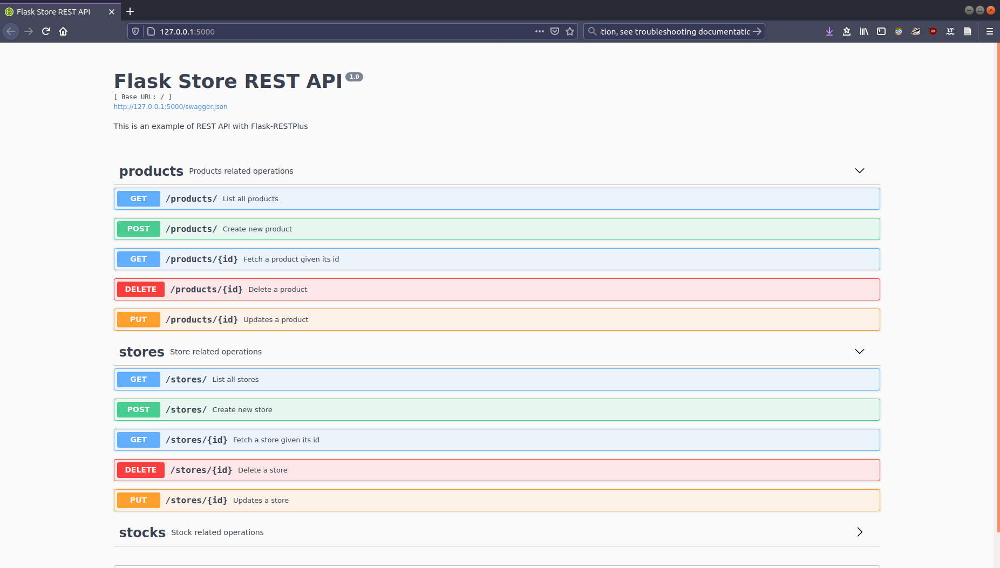
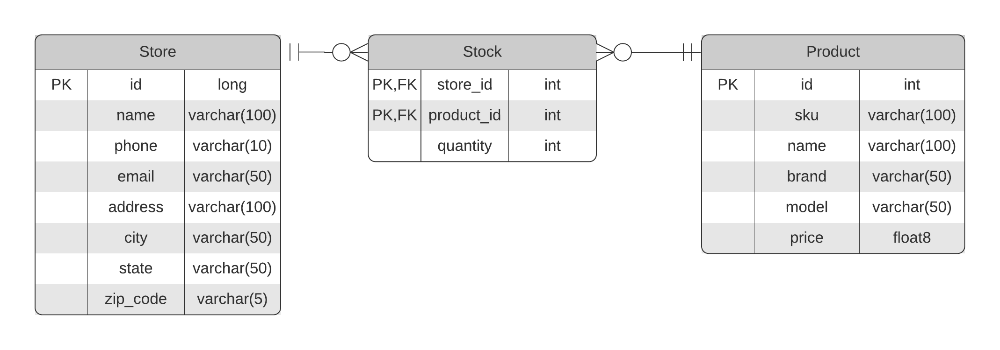

# Flak-RESTPlus Store API

This project contains a demo of a REST API with Flask for inventory management in a store



## Dependencies
 
* `flask`: Micro Web Framework
* `flask-restplus`: For simple REST API and Swagger documentation
* `flask-sqlalchemy`: For support for SQLAlchemy(SQL ORM)
* `flask-marshmallow`: For object serialization/deserialization
* `marshmallow-sqlalchemy`: Marshmallow and SQLAlchemy integration
* `flask-migrate`: For database migrations
* `pytest`: For tests

## Data model



## Project structure

### Directories:

* `app`: This source code of the REST API
* `tests`: This packages contains the test for the api
* `docs`: This contains aux files for documentation

### Files:

* `README.md`
* `config.py`: This is the config  file for the REST API

### Directory structure:

```
root/
├─ app/
│  ├─ __init__.py
│  ├─ apis/
│  │  ├─ __init__.py
│  │  ├─ stocks.py
│  │  ├─ stores.py
│  │  ├─ products.py
│  ├─ models/
│  │  ├─ __init__.py
│  │  ├─ product.py
│  │  ├─ store.py
│  │  ├─ stock.py
├─ tests/
│  ├─ __init__.py
│  ├─ conftest.py
│  ├─ test_product.py
│  ├─ test_store.py
│  ├─ test_stock.py
```
## Setup

### Install dependencies
With conda:
```
conda env create --file enviroment.yml
conda activate flask-rp
```

With pip:
```
pip install -r requirements.txt
```

### Database migration

First set the database URI as env variable:
```
export DATABASE_URL=postgresql://<user>:<password>@localhost:5432/store_api
```

Then do the migration with `flask-migrate`:
```
flask db init
flask db migrate
flask db upgrade
```

### Run the app

```
FLASK_APP=app
flask run
```

### Run the tests

```
python -m pytest --disable-warnings
```